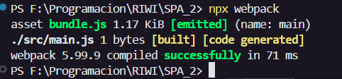

## SPA 2 
Instalar webpack:

        npm i webpack -D

Creamos un archivo "webpack.config.js" con la siguiente estructura:

        module.exports = {
            entry: './src/main.js',
            output: {
                path: __dirname + '/dist',
                filename: 'bundle.js'
            }
        }

Este archivo webpack nos va a servir para tomar el archivo .js que esté dentro de la carpeta 'src', colocando la conversion del archivo en una carpeta (filename= nombre del archivo de salida "bundle.js", path= el archivo que se encuentra por fuera de la carpeta, para ello establecemos la ruta absoluta con la constante "__dirname"  y lo unimos en una carpeta '/dist')

Ejecutamos el siguiente comando:

        npx webpack

    y luego escribimos:

        yes
    
    
        npm init -y

En el package.json pegamos este en la parte de scripts:

         "scripts": {
            "test": "echo \"Error: no test specified\" && exit 1",
            "build": "webpack",
            "dev": "webpack serve --mode development"
        },

Si presentamos algun error tal vez debemos agregar: mode: 'development', en el webpack.config, quedando así:

            module.exports = {
            mode: 'development',
            entry: './src/main.js',
            output: {
                path: __dirname + '/dist',
                filename: 'bundle.js'
                }
            }

Tendremos el siguiente mensaje de confirmacion de que todo ha ido bien:

Lo anterior debe haber creado una nueva carpeta llamada "dist", en esta carpeta se agruparan todos nuestros archivos de tal manera que sean entendibles para el navegador, mietras que nosotros podemos seguir trabajando en nuestras propias carpetas de logica separada como "src".

Ahora agregaremos el html a dist, para lo cual usaremos el siguiente comando:

         npm i html-webpack-plugin -D

Ahora, reemplazamos todo el codigo de webpack.config.js con el siguiente, esto lo que hara es crear un archivo html dentro de dist

        const HTMLWebpackPlugin = require('html-webpack-plugin')

        module.exports = {
            mode: 'development',
            entry: './src/main.js',
            output: {
                path: __dirname + '/dist',
                filename: 'bundle.js'
            },
            plugins: [
                new HTMLWebpackPlugin()
            ]
        }

Volvemos a ejecutar el comando:

        npx webpack

y luego, para verlo de mejor manera, mas entendible en dist:

        npx webpack -d

### Fuente:
https://www.youtube.com/watch?v=D9avX-jtIPM&ab_channel=FaztCode

min: 10:00